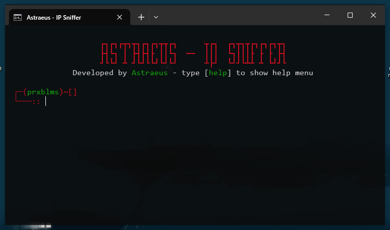

# Astraeus IP Sniffer

## 📌 Sobre a ferramenta
**Astraeus IP Sniffer** é uma ferramenta desenvolvida em Python para capturar endereços IP. Seu foco principal é capturar IPs de chats online, mas pode ser modificada para outras finalidades de captura de IP.

Com o tempo, novas funcionalidades serão adicionadas para permitir capturas mais avançadas.

## 🚀 Funcionalidades
- Captura de IPs em chats online.
- Comandos básicos para interação e controle.
- Estrutura flexível para futuras atualizações.

## 🛠️ Instalação
Antes de instalar, **certifique-se de ter o Python instalado** no seu sistema.

1. Clone o repositório:
   ```bash
   git clone https://github.com/astraeus47/AstraeusIPSniffer.git
   ```
2. Acesse o diretório do projeto:
   ```bash
   cd AstraeusIPSniffer
   ```
3. Instale as dependências:
   ```bash
   pip install -r requirements.txt
   ```

## ▶️ Como usar
Para executar a ferramenta, use o seguinte comando:
```bash
py sniffer.py
```

### 🔹 Comandos disponíveis
- **help** → Exibe o menu de ajuda.
- **exit** → Sai da ferramenta.
- **clear** → Limpa a tela.
- **start** → Inicia a captura de IPs.

## 📌 Notas Finais
- A ferramenta é um projeto em evolução, e futuras atualizações trarão melhorias e novas funcionalidades.
- **Use com responsabilidade!** O uso indevido da ferramenta pode violar leis de privacidade e segurança.

---
📌 **Autor:** Astraeus
📌 **Versão:** 2  
📌 **Linguagem:** Python

---
